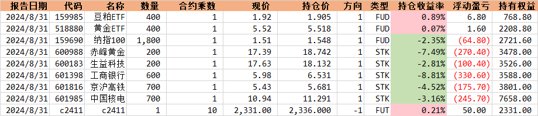

# 2024 年 8 月的回顾

这个月收益很难看，股票上亏损 1371.60，期货上亏损 1500 多。股票从 21 号开始，连续 8 天亏损。期货在螺纹钢上亏钱后一直亏损，之前近 1000 的盈利全部倒亏回去。

## 股票

16 号之前，我的持仓基本持平，但是之后的两周是噩梦的开始，上海医药不断走低，以至于我的收益一直下跌，我在出现一个大箱体的下跌当天将其清仓买入，总体上亏损不多。我卖出的前两天，其 K 线上基本都是纺锤线，箱体很小。我有意识到这个股票的上涨意向降低了，随即清仓。其实是自己的买入点位不好，高点买入了。这种股票是当时追随趋势买入的，表现得很差。

卖出上海医药后，我买入了生益科技和赤峰黄金。

1. 对于生益科技，我主要的考虑的是在 18 附近能形成局部的双重底，其实**我有点着急了，没有等这个低形成就进去，同时幻想这里有双重底**。甚至我现在都还没清仓，有点难以理解了。
2. 对于赤峰黄金，我在 7 月 17 号的高点和 8 月 1 号的高点画了一个趋势线（过拟合 4 月 12 号和 5 月 20 号的场景，觉得能重演，可惜没能）。然后我觉得这条线能够支撑住，同时我自己对黄金有天然的幻想，笼罩在对黄金的喜爱中，理智丧失了。其实我没有清仓它，也是考虑未来黄金会上涨，这是我的弱点，我应该理智，如果没能与 8 月 16 号形成双重底，我会考虑将其清仓，继续观察 15.9-16.4 区间。

后面的三笔买入堪称灾难，中国核电、工商银行、京沪高铁。

1. 关于中国核电，我其实在 16 号的时候就买入了，那个时候买的少，仅仅买了 100 股，然后我等到均线满足 $MA_{18}>MA_9>MA_4$ 的时候，加大了买入的力度。为什么买入的时候看信号，卖出的时候又不看，不在 29 号的时候将其清仓？**这是我的弱点，我总是舍不得卖出这些股票，尤其当要卖的时候，总是幻想着后面的走势，不能坚持自己看到的**。
2. 工商银行实在是太糟糕了，买入之后就是两天暴跌，亏损 8.81%。买入的时候太过冒进，就想着晚了就亏了，着急的追高买入，第一天大跌的时候，我注意到了资金大幅流出，自己无动于衷。第二天放量大跌，还是无动于衷，幻想这市场能反弹。目前来看如果想要长期持有，那么是值得的。短期的话需要考虑是不是应该止损。
3. 京沪高铁也是，趋势都是在下跌，不知道怎么昏了头冲了进去？

### 想买没买的

在我的观察列表中，有两只可惜的：三七互娱和隆基绿能。

这两只我都觉得存在双重底，但是就是不敢买，自己的情绪太差，心态太差，患得患失。隆基绿能在 12.5 附近，三七互娱在 12.3 附近。这两只后面都涨的不错，非常的可惜。

## 期货

慌得一批。刚开始交易期货。

其实我前半个月一直做空，是赚钱的，但是后面的大宗商品反弹我没有把握住，继续空，亏损很多。

这里有点可惜，我本来看指标是能做多白糖的，后面也确实在涨，但是自己胆子小，没去做。

此外，主要自己的仓位管理，不要超过 70%，目前资金少，持有一手就可以了。

## 期末持仓

## 优化

1. 等待，耐性的等待；
2. 不要犹豫；
3. 看准立刻出击，判断错立刻止损；
